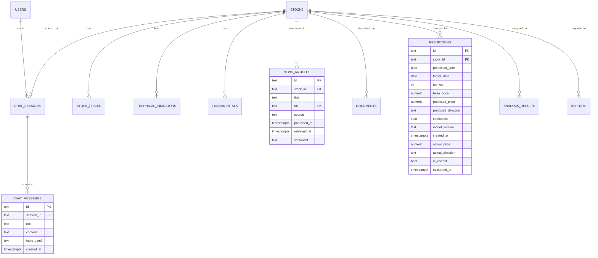

# Database Design

**Current development storage:** an Excel workbook (`backend/storage/dev_database.xlsx`,
created automatically) with one sheet per table. Implementation:
`backend/repositories/excel_store.py`.

**Target:** PostgreSQL (AWS RDS) once the project is tested and deployed to the cloud. The schema
is in [`backend/db/schema.sql`](../backend/db/schema.sql) and uses the same table and column
names (`backend/repositories/schema.py`). Services only use the repository interface
(`insert`, `find`, `find_one`, `update`), so switching means adding a Postgres repository
and setting `DB_BACKEND=postgres`. No service code changes.

Price history is still read from the CSV dataset (`backend/services/data`), or from yfinance
when `LIVE_MARKET_DATA=true`. The `stock_prices` table is defined for the PostgreSQL migration.

## Tables

| Table | Purpose |
|---|---|
| users | User accounts and profile information |
| stocks | Stock identifiers, exchanges and company metadata |
| stock_prices | Historical and processed price/volume data |
| technical_indicators | Calculated indicators and their timestamps |
| fundamentals | Structured company/fundamental information |
| news_articles | News content, source, publication time, retrieval time, sentiment |
| documents | RAG source documents and ingestion metadata |
| predictions | ML predictions, confidence, horizon, model version and realised outcome |
| analysis_results | Generated analysis summaries and evidence references |
| chat_sessions | Stock-specific AI agent sessions |
| chat_messages | User questions and agent responses (with tools used) |
| reports | Generated report metadata and storage references |

## ER diagram

## Indexing

* `stock_prices (stock_id, date DESC)`: time-series lookups.
* `news_articles (stock_id, published_at DESC)`: freshest news first.
* Partial index `predictions (target_date) WHERE evaluated_at IS NULL`: finds pending evaluations.
* `chat_messages (session_id, created_at)`: conversation history.
