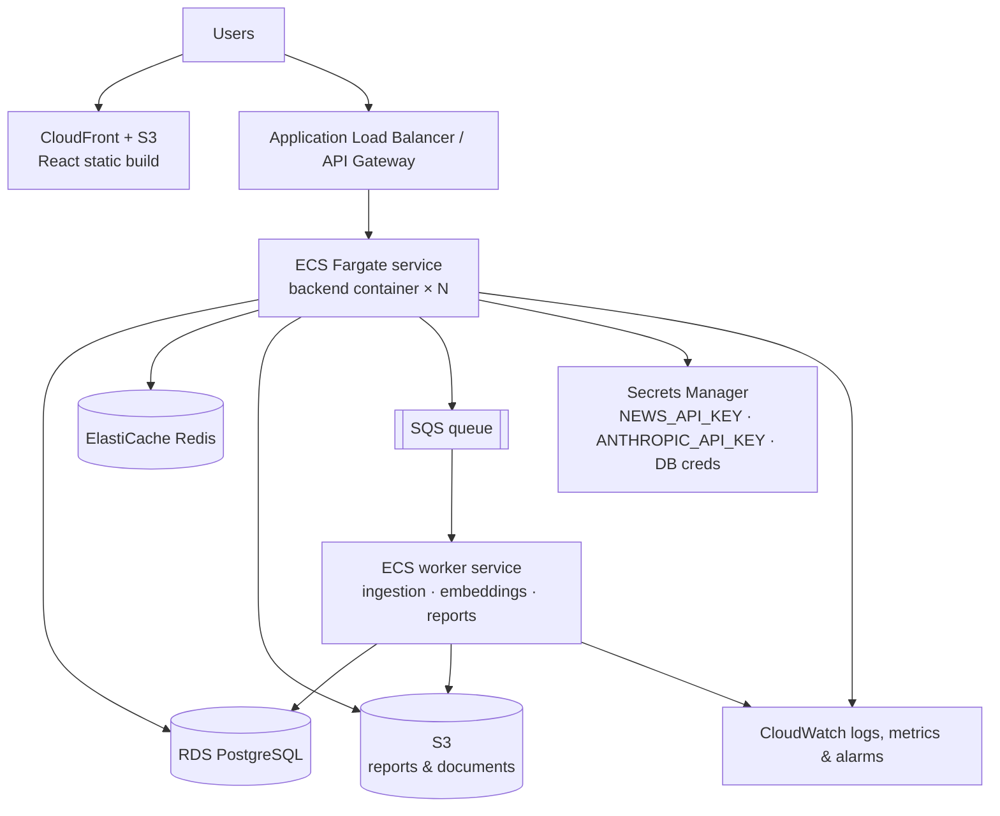

# Cloud & Deployment Architecture (AWS target)

## Local, production-like stack

```bash
cp backend/.env.example backend/.env   # optional keys
docker compose up --build              # frontend :3000, API :10000, Redis :6379
docker compose --profile postgres up   # also start PostgreSQL with db/schema.sql applied
```

## Target AWS architecture



| Concern | AWS service | Notes |
|---|---|---|
| Frontend | S3 + CloudFront | `Dockerfile.frontend` also produces an nginx image if preferred |
| API | ECS Fargate behind ALB | `backend/Dockerfile`, health check on `/api/health` |
| Database | RDS PostgreSQL | apply `backend/db/schema.sql`; set `DB_BACKEND=postgres` once the Postgres repository is in place |
| Cache | ElastiCache Redis | `REDIS_URL`; the app falls back to in-memory if Redis is down |
| Object storage | S3 | reports (`reports.storage_path`) and source documents |
| Queue / workers | SQS + ECS worker | replaces the in-process `workers/job_queue.py` (same submit/status interface) |
| Secrets | Secrets Manager / SSM | nothing sensitive in source; all config via environment |
| Monitoring | CloudWatch | structured logs to stdout, alarms on 5xx rate and latency |
| CI/CD | GitHub Actions | `.github/workflows/ci.yml` runs tests, frontend build and Docker build; add an ECR push + ECS deploy job |

## Scaling notes

* The API layer is stateless apart from three in-process components, each of which has a
  drop-in replacement for multi-instance deployments:
  1. rate limiter → Redis-backed limiter,
  2. job queue → SQS/Celery workers,
  3. vector store → pgvector or OpenSearch.
  Until then, run one gunicorn process per container (the default in the Dockerfile).
* Model training is cached per data fingerprint. Moving training into a scheduled worker that
  writes models to S3 removes cold-start latency from the API.
* External providers (yfinance, NewsAPI, Claude) are wrapped with timeouts, retries and
  fallbacks, so an outage degrades answers instead of failing requests.

## Security checklist

* Authentication: Firebase auth exists on the frontend. Protect user-specific endpoints
  (watchlists, chat history) by verifying Firebase ID tokens in the API.
* Input validation on symbols, questions and session IDs; rate limiting on the agent and report
  endpoints.
* Prompt-injection defence: retrieved content is screened and delimited, and the LLM only
  synthesises from tool evidence.
* CORS restricted with `CORS_ORIGINS`.
* Audit-friendly timestamps on predictions, analysis results, news and reports.
