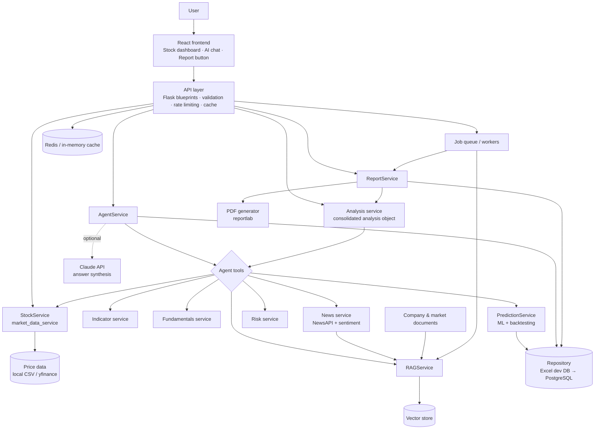

# High-Level Design (HLD)

The platform has grown from a stock price predictor into an AI-assisted stock analysis
system. It brings together market data, technical and fundamental analysis, ML
predictions, news, retrieval-augmented generation (RAG), an interactive stock-specific
agent and downloadable reports.

## Architecture

## Layers

| Layer | Location | Responsibility |
|---|---|---|
| Presentation | `src/components` | Dashboard (`AnalysisDashboard`), chat (`AgentChat`), sources panel, disclaimer |
| API | `backend/routes` | HTTP contracts, input validation, rate limiting, caching, error mapping |
| Business logic | `backend/services` | Market data, indicators, fundamentals, ML, RAG, agent, risk, reports |
| Data access | `backend/repositories` | Storage-agnostic repository; Excel workbook in dev, PostgreSQL schema for the cloud |
| Background processing | `backend/workers` | Async report generation and news/document ingestion |
| Cross-cutting | `backend/core` | Settings, logging, validation, rate limiting |

## Key design decisions

1. **The ML model stays a dedicated numerical layer.** The LLM doesn't make predictions. The agent
   uses the model's output as one piece of evidence and always reports the backtested accuracy
   alongside it.
2. **Deterministic tools first, LLM last.** The agent picks tools from the detected intent and runs
   them in code. The LLM only writes the final answer, using that evidence. This keeps
   answers grounded and testable, and the platform still works without an API key.
3. **Graceful degradation.** Every external dependency (yfinance, NewsAPI, Claude, Redis) is
   optional. If one fails, the request still succeeds with partial evidence, and the gap is called
   out in the answer and the risk factors.
4. **Source grounding.** Every retrieved chunk keeps its source, URL, publication time and retrieval
   time. Answers label each source as current, historical or background.
5. **Untrusted retrieved content.** Retrieved text is screened for instruction-like phrases and
   wrapped in `<document>` delimiters. The system prompt tells the model never to follow
   instructions found inside it.
6. **Modular monolith first.** All services run in one Flask deployment but only talk through
   service interfaces, so they can later be split into separate containers (see
   [DEPLOYMENT_AWS.md](DEPLOYMENT_AWS.md)).

## Data flows

* **Stock page load:** `GET /api/stock/<s>` (legacy price table/chart) runs alongside
  `GET /api/stock/<s>/analysis` (cached consolidated analysis).
* **AI question:** `POST /api/stock/<s>/agent/chat` → intent → tools → evidence → answer + sources.
* **News ingestion:** `POST /api/stock/<s>/ingest` (background job) → NewsAPI → clean → chunk →
  embed → vector store and `news_articles` table.
* **Report:** `GET /api/stock/<s>/report.pdf` (sync) or `POST /api/stock/<s>/reports` → job →
  `GET /api/jobs/<id>` → `GET /api/reports/<id>/download`.

See [LLD.md](LLD.md) for class and sequence designs, [API.md](API.md) for the endpoint
reference and [DATABASE.md](DATABASE.md) for the schema.
