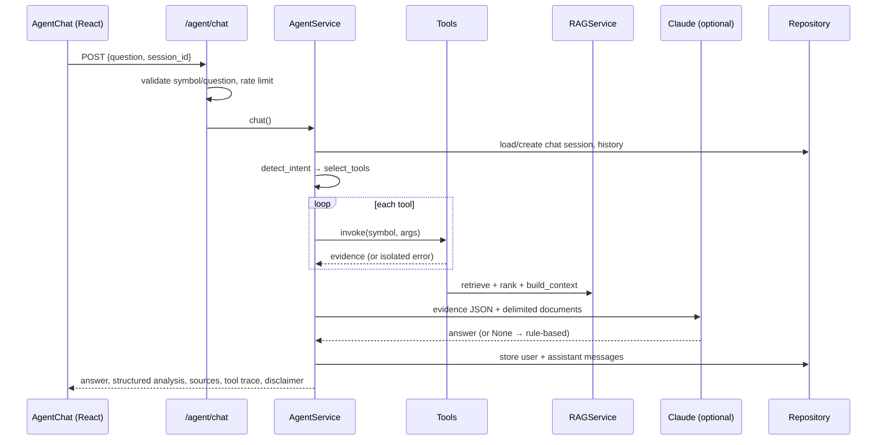
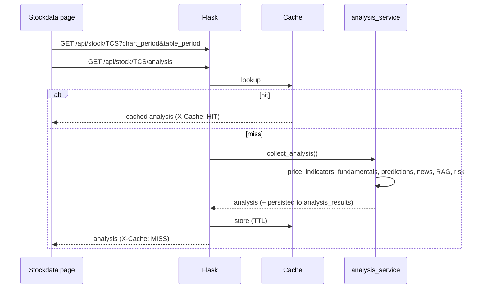
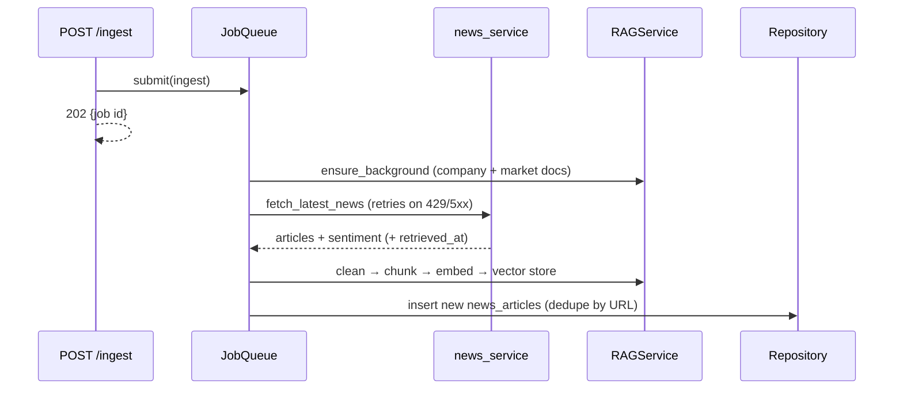
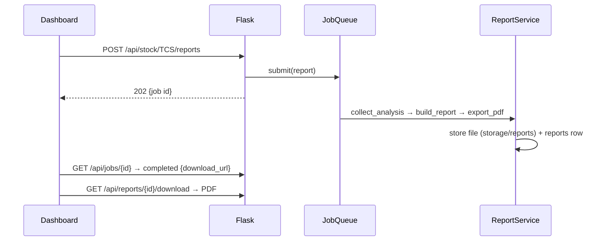

# Low-Level Design (LLD)

## Service responsibilities

```
StockService (services/market_data_service.py)
 ├── list_supported()
 ├── get_stock(symbol)                 -> identity + metadata
 ├── get_price_history(symbol, period) -> OHLCV DataFrame (CSV or yfinance)
 ├── get_live_price(symbol)            -> latest quote with source/as_of/retrieved_at
 └── get_stock_metrics(symbol)         -> 52w range, returns, avg volume

PredictionService (services/prediction_service.py)
 ├── prepare_features(df)              -> 17 engineered features
 ├── predict(symbol, horizon)          -> direction, P(up), confidence, price, model_version, backtest
 ├── predict_all(symbol)               -> one prediction per configured horizon (1, 5)
 └── evaluate_prediction(symbol)       -> realised outcomes for stored predictions

RAGService (services/rag/rag_service.py)
 ├── ingest_text / ingest_local_documents / ingest_news / ingest_analysis
 ├── retrieve_documents(symbol, query) -> vector candidates (stock + market scope)
 ├── rank_documents(candidates)        -> relevance × freshness, de-duplicated
 └── build_context(symbol, query)      -> delimited context + source list

AgentService (services/agent/agent_service.py)
 ├── detect_intent(question)           -> outlook/technical/fundamental/news/risk/company/price/report
 ├── select_tools(intents)             -> ordered tool list
 ├── execute_tools(symbol, tools)      -> results + per-tool trace (errors isolated)
 ├── generate_response(...)            -> answer (LLM or rule-based) + structured analysis + sources
 └── chat(symbol, question, session_id)-> persists chat_sessions / chat_messages

ReportService (services/report_service.py)
 ├── collect_analysis(symbol)          -> consolidated analysis object
 ├── build_report(analysis)            -> 14 report sections
 ├── export_pdf(story, file_name)      -> PDF path
 └── generate(symbol)                  -> report metadata row
```

Supporting modules: `indicator_service` (SMA/EMA/RSI/MACD/Bollinger/ATR and their
interpretation), `fundamentals_service`, `risk_service` (volatility, drawdown, VaR/CVaR, Sharpe,
risk factors), `news_service` (NewsAPI with retries, sentiment, persistence),
`analysis_service` (consolidation), `workers/job_queue.py`, `repositories/*`.

## Agent tools

| Tool | Backed by |
|---|---|
| `get_live_price()` | `StockService.get_live_price` |
| `get_historical_prices()` | `StockService.get_price_history` + metrics |
| `get_technical_indicators()` | `indicator_service.get_technical_indicators` |
| `get_fundamentals()` | `fundamentals_service.get_fundamentals` |
| `search_latest_news()` | `news_service.fetch_latest_news` → RAG ingestion + persistence |
| `retrieve_company_documents()` | `RAGService.build_context` |
| `run_ml_prediction()` | `PredictionService.predict` |
| `calculate_risk()` | `risk_service.calculate_risk` (uses prediction/news/indicator results) |
| `generate_report()` | link to `/api/stock/<s>/report.pdf` |

## Sequence: AI question to answer



## Sequence: stock page load



## Sequence: news ingestion and embedding



## Sequence: ML prediction and evaluation

```mermaid
sequenceDiagram
    participant C as Caller
    participant P as PredictionService
    participant S as StockService
    participant DB as predictions table
    C->>P: predict(symbol, horizon)
    P->>S: get_price_history(max)
    P->>P: fingerprint data; cache hit? reuse model
    P->>P: prepare_features → targets(horizon)
    P->>P: walk-forward CV over candidates; choose best classifier/regressor
    P->>P: fit on all labelled data; predict latest row
    P->>DB: insert prediction (dedupe by date/horizon/model_version)
    C->>P: evaluate_prediction(symbol)
    P->>DB: rows with target_date ≤ last price date
    P->>DB: update actual_price, actual_direction, is_correct
```

## Sequence: report generation and download



The dashboard's **Download full report** button uses the synchronous
`GET /api/stock/<s>/report.pdf` endpoint, which runs the same pipeline inline.

## Data contracts (abridged)

```jsonc
// GET /api/stock/TCS/forecast?horizon=5
{
  "symbol": "TCS", "horizon_trading_days": 5,
  "prediction_date": "2025-08-14", "target_date": "2025-08-21",
  "base_price": 3022.3, "predicted_price": 3021.99, "expected_return_pct": -0.01,
  "predicted_direction": "up", "probability_up": 0.63, "confidence": 0.63, "outlook": "Bullish",
  "model_version": "random_forest+ridge-h5-v2-a47de787",
  "backtest": { "directional_accuracy": 0.52, "baseline_accuracy": 0.50, "mae": 84.5, "rmse": 110.3, "...": "..." }
}
```

See [API.md](API.md) for every endpoint.
